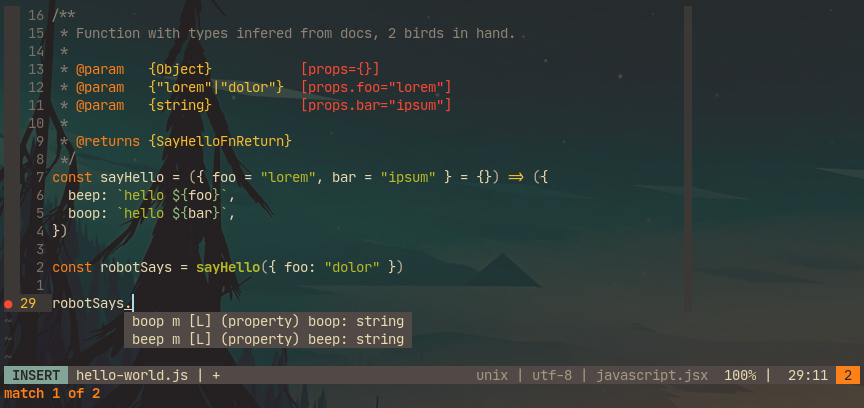

<!-- markdownlint-disable line-length -->

# tpl-ts-jsdoc

> Plain Javascript with Typescript as JSDoc comments.

<!-- vim-markdown-toc GFM -->

* [Stack](#stack)

<!-- vim-markdown-toc -->

## Stack

* Main: [Typescript 4](https://github.com/microsoft/TypeScript)
* Testing: [riteway](https://github.com/ericelliott/riteway)
* Linting: [ESLint](https://github.com/eslint/eslint), [@asd14/eslint-config](https://github.com/asd-xiv/eslint-config)
* Code formatting: ESLint rules + [prettier](https://github.com/prettier/prettier)
